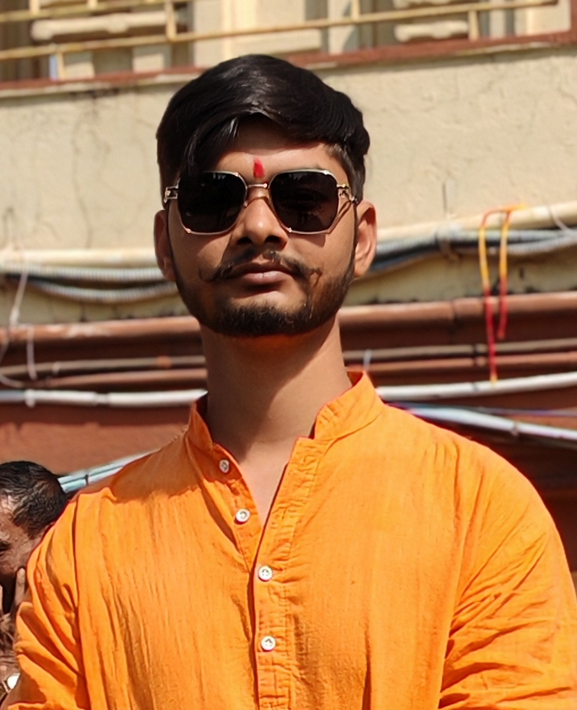

<!DOCTYPE html>
<html lang="en">
<head>
  <meta charset="UTF-8">
  <meta name="viewport" content="width=device-width, initial-scale=1.0">
  <title>Siddhant Kumar | Portfolio</title>

  <!-- Google Fonts -->
  <link href="https://fonts.googleapis.com/css2?family=Poppins:wght@300;400;600;700&display=swap" rel="stylesheet">

  <!-- Font Awesome (for icons) -->
  <link rel="stylesheet" href="https://cdnjs.cloudflare.com/ajax/libs/font-awesome/6.5.0/css/all.min.css">

  
</head>
<body>

  <!-- Navbar -->
  <header>
    <h1>My Portfolio</h1>
    <nav>
      <ul>
        <li><a href="#hero">Home</a></li>
        <li><a href="#about">About</a></li>
        <li><a href="#journey">Education</a></li>
        <li><a href="#skills">Skills</a></li>
        <li><a href="#contact">Contact</a></li>
      </ul>
    </nav>
  </header>

  <!-- Hero -->
  <section class="hero" id="hero">
    

      <h2>Hi, I'm Siddhant Kumar</h2>
      <h3>Web Developer</h3>
      
I love building websites as a Web Developer and am keenly exploring Cybersecurity to ensure my applications are both functional and secure.

      <a href="#contact" class="btn btn-primary">Hire Me</a>
      <a href="#contact" class="btn btn-outline">Let's Talk</a>

      <!-- Social Media -->
      

        <a href="https://github.com/yourusername" target="_blank"><i class="fab fa-github"></i></a>
        <a href="www.linkedin.com/in/ustadsiddhu" target="_blank"><i class="fab fa-linkedin"></i></a>
        <a href="https://twitter.com/yourusername" target="_blank"><i class="fab fa-twitter"></i></a>
      

    

    
  </section>

  <!-- About -->
  <section id="about" class="about">
    <h2 class="section-title">About Me</h2>
    
    
I specialize in turning ideas into functional and engaging web experiences. With expertise in HTML, CSS, JavaScript, and React, I create applications that balance performance and usability. I enjoy building web projects, interactive interfaces, and learning Cybersecurity practices to make my applications secure and reliable.

  </section>

  <!-- Journey -->
  <section id="journey">
    <h2 class="section-title">My Journey</h2>
    

      

        <h3>Education</h3>
        
10th Degree – High School Parari, Sitamarhi (Bihar)

        <small>2017–2018</small>
        
Intermediate in Science – High School Parari, Sitamarhi (Bihar)

        <small>2018–2020</small>
        
Bachelor's Degree – Lalit Narayan Mithila University, Darbhanga (Bihar)

        <small>2021–2024</small>
      

      

        <h3>Experience</h3>
        
        

        
      

    

  </section>

  <!-- Skills -->
  <section id="skills">
    <h2 class="section-title">My Skills</h2>
    

      

        <h3>Coding Skills</h3>
        
HTML

        
CSS

        
JavaScript

        
Python

        
Java

      

      

        <h3>Professional Skills</h3>
        
Web Design

        
Web Development

        
Social Media Design

        
      

    

  </section>

  <!-- Contact -->
  <section id="contact">
    <h2 class="section-title">Contact Me</h2>
    <form class="contact-form">
      <input type="text" placeholder="Full Name" required>
      <input type="email" placeholder="Email Address" required>
      <input type="text" placeholder="Mobile Number">
      <input type="text" placeholder="Subject">
      <textarea placeholder="Your Message" rows="6"></textarea>
      <button type="submit">Submit</button>
    </form>
  </section>

  <!-- Footer -->
  <footer>
    
© 2025 Siddhant Kumar | All Rights Reserved.

  </footer>

  <!-- Scroll to Top -->
  <button id="topBtn">↑</button>
  
</body>
</html>
